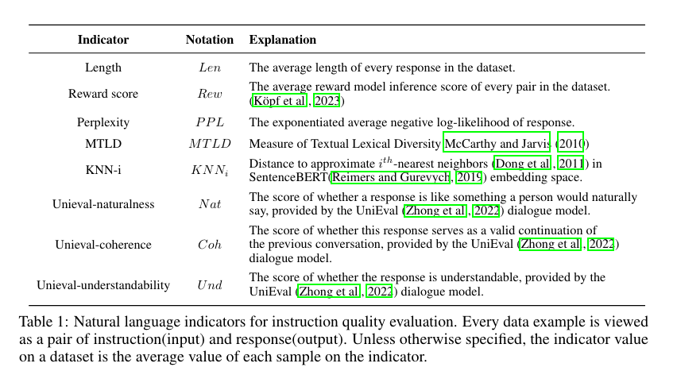

# Instruction Mining: High-Quality Instruction Data Selection for Large Language Models   

[前言](https://github.com/DylanDDeng/paper_reading_notes/blob/main/data_quality/Instruction_Mining.md#前言) 

[设计方案与实验](https://github.com/DylanDDeng/paper_reading_notes/blob/main/data_quality/Instruction_Mining.md#设计方案与实验) 

[效果评价](https://github.com/DylanDDeng/paper_reading_notes/blob/main/data_quality/Instruction_Mining.md#效果评价) 

[结论](https://github.com/DylanDDeng/paper_reading_notes/blob/main/data_quality/Instruction_Mining.md#结论)

## 前言 

本篇论文是来自CMU和Lehigh大学的三位作者，关于给大语言模型选择高质量的指令数据的文章。原论文地址：[https://arxiv.org/abs/2307.06290](https://arxiv.org/abs/2307.06290) 

作者指出尽管指令微调能够大幅度地提升大模型理解人类指令的能力，但是获取高质量的指令现阶段比较常用的手段还是要经过人工的处理。所以，作者在这里提出了一种叫做指令挖掘(Instruct Mining)的方法,这种方法是基于一种线性的规则，能够在不需要人工的情况下选择高质量的指令数据。 

通过这种方法选择的数据去做模型微调后，发现模型在42.5%的情况下表现更好。 
> *Comprehensive results show that INSTRUCTMINING can significantly improve finetuning performance. The model fine-tuned on filtered data performs better in 42.5% of the cases.* 

## 设计与实验 

首先，我们要理解一个概念，什么叫做指令质量？ 

通常来说，一个模型掌握的大部分知识都是在预训练阶段学习的；在微调阶段，指令数据会教模型怎么去更好地遵守人类的意图，跟人类进行互动，所以，指令数据的质量可以看作一种引导语言模型以特定方式生成响应的能力。简单来说就是，指令数据的质量决定了模型响应人类指令的能力，指令数据的质量高，那模型响应人类指令的能力就会好。 
> *the quality of these instruction-following data could be viewed as its ability to efficiently steer language models in learning to generate responses in a particular manner.* 

基于此，作者提出了一个评估指令质量评估的推测，如下： 

给定一个指令数据集，记作$`D`$，基于这个指令数据集，微调了一个模型，记作$`\tilde{M}`$。那么这个指令数据集$`D`$的质量是可以通过微调模型$`\tilde{M}`$在评估集$`D_{eval}`$上的推理损失进行估计的。

为了确保模型推理的损失能够提供对数据质量评估提供一个有效的度量，评估集$`D_{eval}`$需要由无偏的，高质量的指令数据样例组成。 

上述的文字表达，如果用数学符号来表示，则为如下： 
$$`
Q_{D|M,S} \propto -L(\tilde{M}, D_{eval})
`
$$ 

在这个式子里，$`D_{eval}`$ 指的是高质量的无偏评估集，$`D`$是指令数据集，$M$是需要微调的基线模型，$S$是训练的参数设置集合，$`\propto`$表示正比例。

根据这个式子，我们可以利用微调后的模型$`\tilde{M}`$在评估集$`D_{eval}`$的损失来评估指令数据集的质量。但是，这么做，效率是很低的，因为还要涉及到微调模型这一步，所以作者在这里引入了一些自然语言的指标，并使用这些指标来预测推理损失，从而评估指令数据的质量。

论文中给出的自然语言指标如下所示：
  

这些指标组成一个集合$`I`$表示，{$`I={I_{i},i \in N^{*}}`$}；给定指令数据集$`D`$,我们就可以计算对应的指标的值，记作$`I(D)={I_{i}(D), i \in N^{*}}`$,这样，我们就可以认为存在一个函数$`F`$使得之前提到过的模型推理损失$`L(\tilde{M},D_{eval})`$可以用$`F(I(D))`$来近似。

用数据公式来表达，作者也在原论文中给出，则如下所示：
  

通过这个式子，我们可以看到指令数据的质量的负数与微调模型的对数推理损失成正相关的关系，而损失又可以通过一个函数$`F`$去逼近。

作者假设存在多变量线性函数$`I_{i}, i \in {1,...,n}`$使得与对数损失成比例关系，则上面那个式子就可以重新写成如下：

$$`  
\begin{aligned}

logL(\tilde{M},D_{eval}) &\propto L_{0} + F{(D)}\\
&\propto L_{0} + \beta_{0} + \beta_{1}I_{1}(D) + ...+\beta_{n}I_{n}(D) + \epsilon  

\end{aligned} 
`
$$ 

$`\beta_{0}`$是常数，$`\beta_{i}, i\in N^{*}`$是线性系数，$`\epsilon`$是随机噪音。 

这里我们稍微总结一下，作者等于说把评判一个指令数据集已经转化成了一个线性回归的问题，把一些自然语言指标作为输入$`x_{i}`$,对数损失作为输出$`y_{i}`$,以此来评估指令数据的质量。 

到这里作者关于指令数据的质量的推测就解释完了，下面来看一下作者具体是怎么设计实验的。 

作者进行了两类实验了来检验自然语言指标和数据集质量的关系，一种是多变量相关性实验还有一种是单变量相关性实验。两种实验的主要区别在于数据采样的策略不同。 

对于多变量实验流程，作者给出了下图示例进行解释
  

整个多变量实验流程分为如下几步： 
* 首先选择一些候选的数据集
* 对它们进行采样和融合，组成质量不同水平的数据集。
* 对每一个数据集，都微调一个语言模型，然后在共享的评估集上进行评估；并且计算不同数据集中，每一个自然语言指标的值。 
* 最终，进行线性回归分析，预估线性规则参数。 

对于单变量的实验，作者不是像之前那样随机采样，而是进行了细颗粒度的采样,子数据集的采样基于自然语言指标的值。对于一个指定的指标$`I_j`$, 采用一系列相同大小的子数据集，这些子数据集具有细颗粒指标值。 

这里我们拿作者原论文中举的一个例子来说明。考虑一个指标，*Rew*, 计算数据集中每个样本的得分，然后将这些得分从低到高进行排序。因此，这些数据样本根据它们各自的*Rew*得分被分为K个层次。 对于每个数据集，作者微调了一个基础模型，并进行评估，以获得采样指令数据集的质量估计。然后使用相关性分析工具来评估每个数据集的质量值与指标值之间的关系。 

### 实验设置 

**数据集** 为了创建各种不同的训练数据集，作者选了如下几个数据集作为备选训练集。
 

作者分别对这几个数据集进行了如下操作： 

* **Alpaca**是用OpenAI的text-davinci-003生成的52,000条指令数据集，作者使用了与ALPACA相同的提示模版。 

* **Open Assistant**是一个开源的聊天数据。作者将多轮的对话过滤掉，只需要单轮的对话，并且只保留了英文对话，将人类说话的内容作为指令，助手回答的内容，作为输出的内容。 

* **Stack Exchange**是一个问答网站，这个网站对回答内容有一个投票机制，回答的好的内容会被投赞成票，回答的不好的内容则会被投反对票，这种机制确保了内容的质量。作者选择了那些被投了高票的问答，将投赞成票的数小于等于5的问答都过滤掉；并且将回答字数低于200和多于4000的，以及回答中含有HTML标签都过滤掉。

* **wikiHow**是一个全球性的合作平台，为了教人们做任何事。作者使用标题作为提示，相应的正文作为回应。为了确保数据的多样性，作者使用了句子转换器从标题中提取嵌入，然后使用K-means聚类将它们分为19个类别。接着，随机选择一个类别，并且从这个类别中随机选择一个数据集，从而得到一个包含2000个指令的数据集。  

* **Dolly**是一个生成的，包含15,000条指令的数据集。  

**评估集** 作者通过结合不同的评估集，多样化了不同的指令，然后再用gpt-3.5-turbo针对每个指令，生成5个不同的回答以选择更好的结果。 

**采样备选数据集** 作者合并了备选的几个数据集，然后通过采样的技术，构建每个数据集为2000个指令输出对。

**多变量分析采样技术**作者针对每一个数据集产生一个随机数$`r_{i}`$,然后通过$`\frac{2000 * r_i}{\sum_{i}r_i}`$ 进行随机采样。 

**单变量分析采样技术** 作者合并了所有的数据集，并且根据指标值进行排序。然后在排序后的数据上均匀地选择了k个分位数作为起始点，并提取了接下来的2000个连续数据形成了一个新的数据集。这种选择确保了目标指标的多样性结果。作者在这里将K设定为8，并且考虑到ALPACA和其他数据集之间的显著大小差异，从ALPACA中随机抽取了2000个数据，以确候选数据之间的规模的一致性。 

## 效果评价 

### 多变量分析 
作者随机采样了78个备选的数据集，线性回归分析如下图所示

 
作者首先分析了每个指标值的分布，确保他们满足线性回归的假设条件，然后进行了Kolmogorov-Smirnov测试，确保每个变量满足正态分布。

然后作者进行了stepwise regression分析，结果如下图所示：
 

根据上图的结果，我们可以看到如下几个指标变量是具有统计学重要性的：
* Rew
* Len 
* $`Knn_6`$ 

所以之前的那个公式，就被写成了如下：
 

### 单变量分析 
针对单变量分析，结果如下图所示：
   
通过上图，我们可以看到作者分析了每个指标与评估损失的线性相关性。变量PPL，MTLD，NAT和UND与评估损失呈正相关性，Rew和Coh呈负相关性。这意味着Rew和Coh的增加可能会导致损失的减少。与从数据池中随机按比例选择相比，关注这些指标来选取数据会更可取一点。值得注意的是，这并不与多变量分析中的分析矛盾，因为多个指标对推理损失的波动起到了显著性的作用，而这些指标是可能存在多重共线性问题的。  

## 结论  

作者在这篇论文中提出了一种评估数据集质量的规则；然而，这当然仍然存在着一些问题。
* 作者在这里只是提供了一些之前工作中比较常见的有限的指标，最近也有很多学者开始研究指令多样性的问题，这在他们之后的工作中也会包括进去。
* 他们的方法只在单轮的指令问答上进行过实验；没有在多轮以及更复杂的对话问题上进行实验。 
* 最后就是他们只在LLAMA-7B上研究了指标值和推理损失的关系，并没有在其他更大的模型上做过实验。 